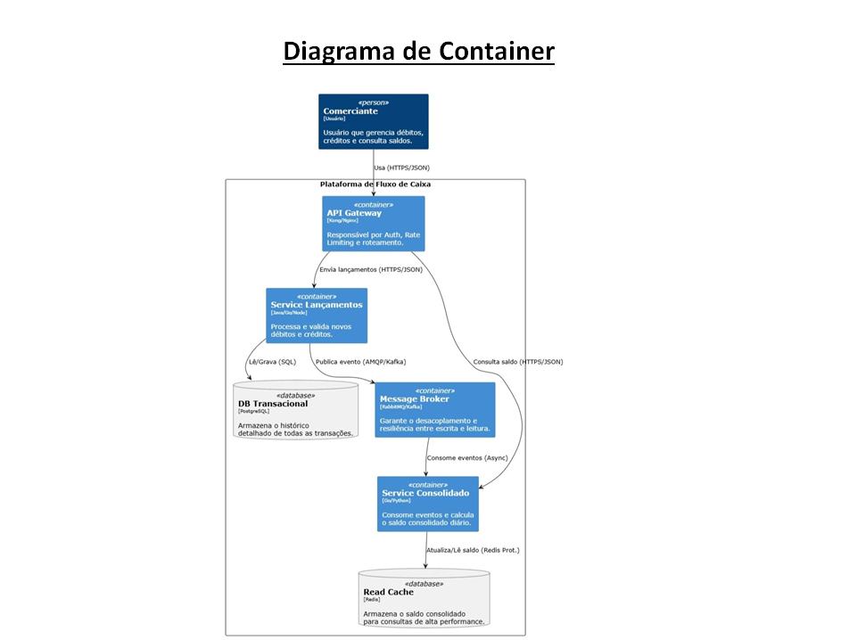
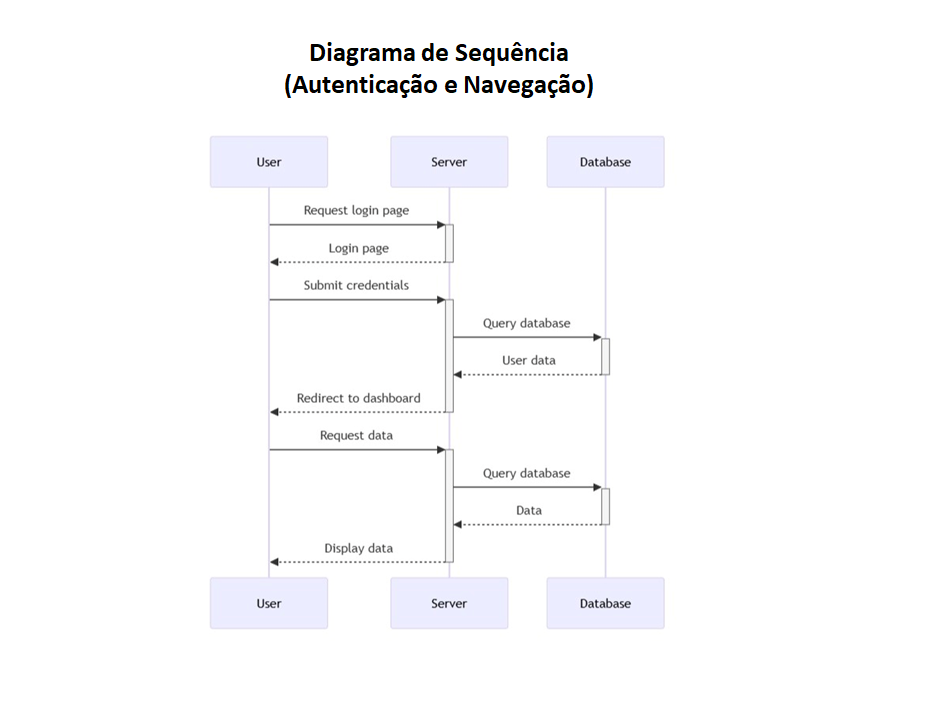

# Desafio Técnico: Arquiteto de Soluções - Fluxo de Caixa

## 🎯 Objetivo
Solução escalável e resiliente para controle de lançamentos financeiros e consolidação de saldo diário.

## 🏗️ Arquitetura Proposta (C4 Model)

> *Nota: A arquitetura utiliza o padrão CQRS e Mensageria (RabbitMQ) para garantir que o serviço de lançamentos não pare caso o consolidado esteja offline.*

## 🛠️ Stack Tecnológica
- **Backend:** .NET 8 (C#)
- **Banco de Dados:** PostgreSQL (Escrita) e Redis (Cache/Leitura)
- **Mensageria:** RabbitMQ ou Azure Service Bus
- **Infra:** Docker + Kubernetes (AKS/EKS)
- **Observabilidade:** Prometheus + Grafana + OpenTelemetry

## 💸 Estimativa de Custos (AWS - US-East-1)

| Recurso | Configuração | Custo Mensal (Est.) |
| :--- | :--- | :--- |
| Compute (ECS/Fargate) | 2 Microservices (HA) | US$ 60,00 |
| Database (RDS) | db.t3.medium (Multi-AZ) | US$ 70,00 |
| **Total Estimado** | | **US$ 320,00** |

## 📂 Documentação Complementar
- [Clique aqui para baixar o PDF com a proposta completa](./Docs/Desafio_arquitetura.pdf)
- [Apresentação em PowerPoint (PPTX)](./Desafio_arquitetura.pptx)
